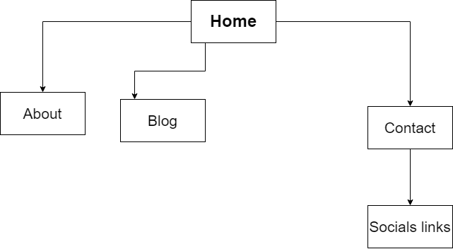
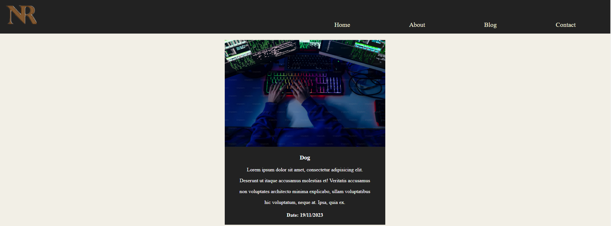
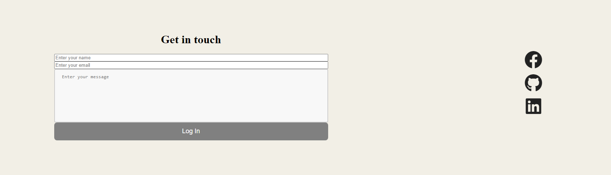

# Purpose
The purpose of my portfolio was to create a minimilistic portfolio allowing viewers to not be overwhelemed at what they are looking at. Allowing for a clean portfolio that seamlessly flows, and captures the attention of viewers.  


# Inspiration
Before desining my portfolio website I knew i wanted to have a simplistic style that was consitent in all my pages. I went to pintrest of my inspiration, using the search term "minimlist portfolio about page" allowed me to generate a small handful of examples I used as inspiration. 

Main inspiration from pintrest

 


 # Sitemaps
 My goal for my sitemaps was to make the all the pages flow seamlessly. My goal was not to overwhelm myself and users.




## Blog Page 
In the blog page i incorporated basic HTML and css code to create a clean and cohesive design utilizing flexbox and using the same color for the header and footer to help the description under the blog posts stand out more 


```html
            <article>
                <section>
                    
                </section>
                <section>
                    <h3>Dog</h3>
                    <p>Lorem ipsum dolor sit amet, consectetur adipisicing elit.</p> 
                    <p>Deserunt ut itaque accusamus molestias et! Veritatis accusamus</p> 
                    <p>non voluptates architecto minima explicabo, ullam voluptatibus </p>
                    <p> hic voluptatum, neque at. Ipsa, quia ex.</p>
                    <h4>Date: 19/11/2023</h4>
                </section>
            </article>
```

I copied the same format 5 different times to create more blog posts 


```css
main {
    display: flex;
    justify-content: space-around;
    flex-direction: column;
    align-items: center;
    flex-wrap: wrap;


   article {
    margin: 20px 0px;
    text-align: center;
    background-color: $primary-color;
    

    section {
        color: white;
        .blog-image {
            width: 500px;
        }
    }
   } 
}
```

I utlised the scss '$' attribute to easily create the color under the blog posts


This is an example of one of the blog posts 



## Contact Page
For the contact page i created a basic form inside html and css. For the submit button, I added a styling element where the button would keep the same width as the form no matter the screen size 

This was accomplished using this css

```css
  #contact-container {
    background-color: $secondary-color;
    display: flex;
    flex-direction: row;
    justify-content: space-around;
    align-items: center;
    margin-top: 3%;
    text-align: center;

    .contact-form {
    display: flex;
    flex-direction: column;
    width: 40%;
    margin-top: 0%;  

  
 }

 .contact-links {
    display: flex;
    flex-direction: column;
    gap:15px;

        i{
        font-size: 50px;
        color: $primary-color;
    }
   
 }


#email-input {
    margin-left: 40px;
}

#password-input {
    margin-left: 20px;
}

#submit-btn {
    height: 50px;
    width: auto;
    font-size: 18px;
    background-color: gray;
    color: rgb(255, 255, 255);
    border-radius: 8px;
    border: none;
    cursor: pointer;
}

#submit-btn:hover {
    background-color: rgb(0, 0, 0);
}
textarea {
    width: 100%;
    height: 150px;
    padding: 12px 20px;
    box-sizing: border-box;
    border: 2px solid #ccc;
    border-radius: 4px;
    background-color: #f8f8f8;
    resize: none;
  }
}
```




I added the Links as the same color as the nav bar and footer as i felt it fit the concept.

Link to my website

https://nicholasrowe.netlify.app/ 

Link to my presentation 

https://youtu.be/KhGVWydr0Hg