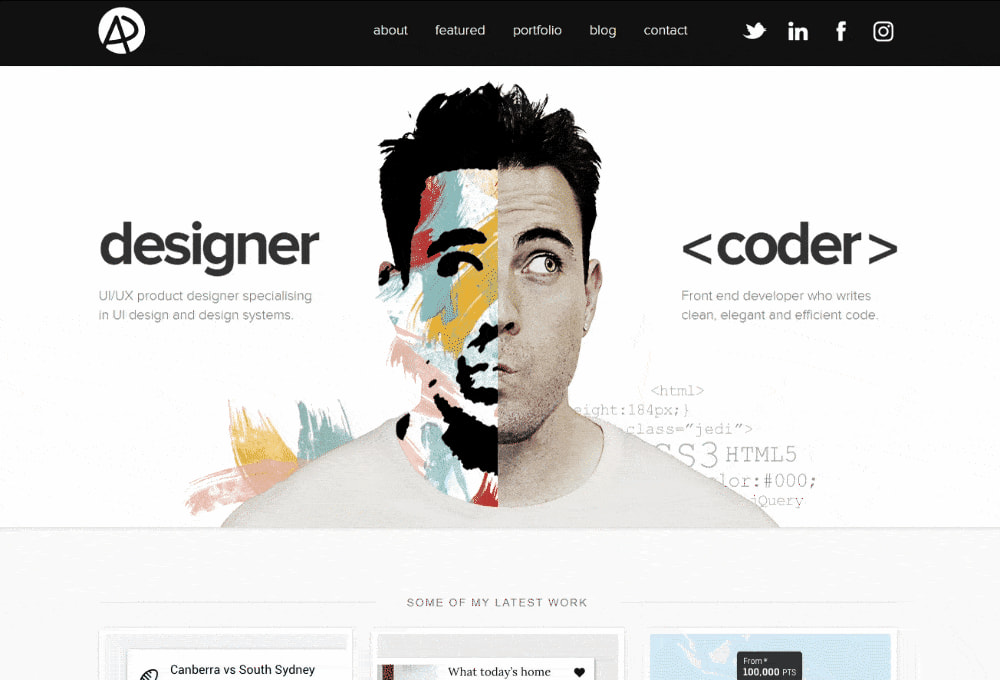

# Purpose
The purpose of my portfolio was to create a minimilistic portfolio allowing viewers to not be overwhelemed at what they are looking at. Allowing for a clean portfolio that seamlessly flows, and captures the attention of viewers.  

# Inspiration
Before desining my portfolio website I knew i wanted to have a simplistic style that was consitent in all my pages. I went to pintrest of my inspiration, using the search term "minimlist portfolio about page" allowed me to generate a small handful of examples I used as inspiration. 

Main inspiration from pintrest

 

 # Funtionality and Features 

 ### Functionality 

 ### Features
 I added an animation to the home page for the profile picture and the short home page 

 # Sitemaps
 My goal for my sitemaps was to make the all the pages flow 